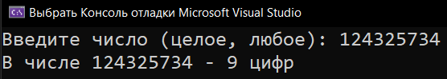
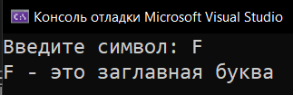
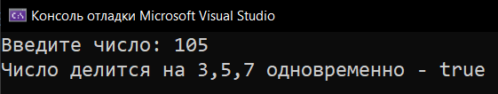
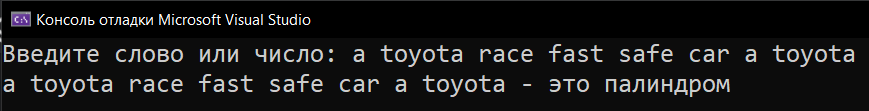
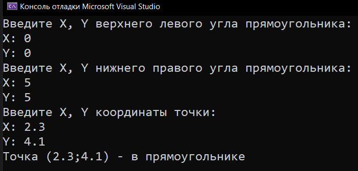

# Homework_7_Operators
Д/з: Operators

<a href="https://gist.github.com/SlavikArt/ab562d882423dbfb291ece3efcc1b813">Gist - страница со всеми кодами проектов</a>

* [Define_Amount_Of_Numbers](Define_Amount_Of_Numbers)
* [Define_Input](Define_Input)
* [Is_Divided_By_3_5_7](Is_Divided_By_3_5_7)
* [Is_Palindrome](Is_Palindrome)
* [Is_Point_In_Square](Is_Point_In_Square)

    <h2>Define amount of numbers</h2>
    
Сколько цифр в числе.

    
    <h2>Define input</h2>
    
Распознать ввод (число, символ...).

    
    <h2>Is divided by 3 5 7</h2>
    
Число делится на 3, 5, 7одновременно?

    
    <h2>Is palindrome</h2>
    
a toyota race fast safe car a toyota

    
    <h2>Is point in square</h2>
    
Принадлежит ли точка этому прямоугольнику?

    

